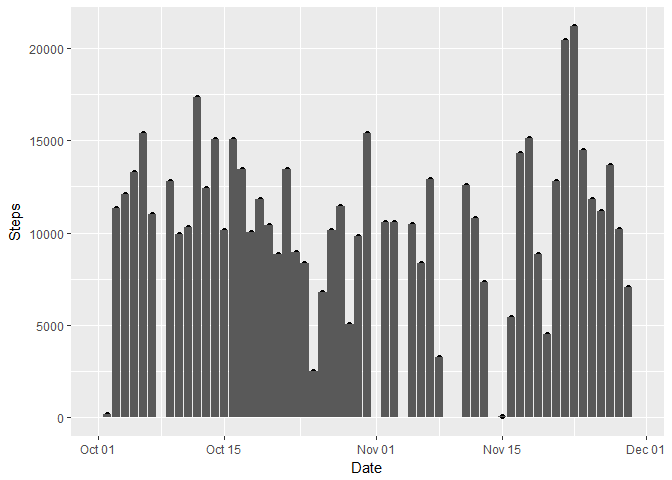
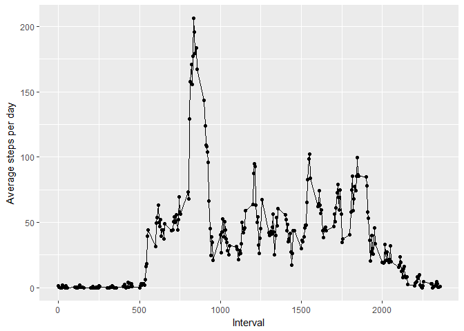
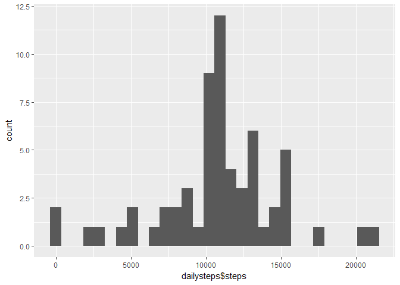
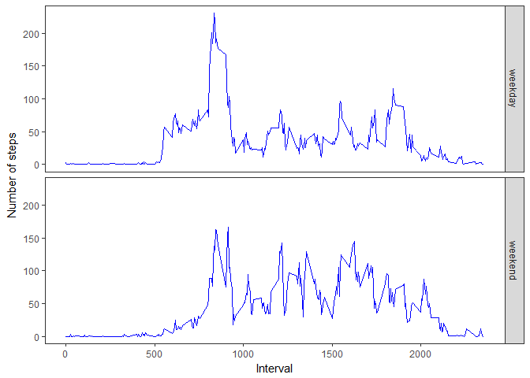

# Reproducible Research: Peer Assessment 1

## Loading and preprocessing the data

Start by unzipping the file and reading the data into our variable

```r
unzip("activity.zip")
activity <- read.csv("activity.csv")
activity$date <- as.Date(activity$date)
```

## What is mean total number of steps taken per day?

We first calculate the total steps taken each day across all intervals

```r
dailysteps <- aggregate(activity$steps,list(activity$date),sum)
names(dailysteps) <- c("date","steps")
```

Here's a bar-plot of the same:

```r
library(ggplot2)
qplot(dailysteps$date, dailysteps$steps) + geom_bar(stat = "identity") + labs(x = "Date", y = "Steps")
```

```
## Warning: Removed 8 rows containing missing values (position_stack).
```

```
## Warning: Removed 8 rows containing missing values (geom_point).
```

<!-- -->

```r
meansteps <- mean(dailysteps$steps, na.rm = TRUE)
mediansteps <- median(dailysteps$steps, na.rm = TRUE)
```

The mean total number of steps taken per day is:

```
## [1] 10766.19
```

and median is:

```
## [1] 10765
```
We have ignored NA values

## What is the average daily activity pattern?

First calculating the mean number of steps in each interval across all days

```r
averagesteps <- aggregate(activity$steps,list(activity$interval), mean, na.rm=TRUE)
names(averagesteps) <- c("interval","avgsteps")
```

Here's a plot of the data:

```r
qplot(averagesteps$interval, averagesteps$avgsteps) + geom_line() + labs(x = "Interval", y = "Average steps per day")
```

<!-- -->

```r
maxstepsinterval <- averagesteps$interval[averagesteps$avgsteps == max(averagesteps$avgsteps)]
```

The interval with the maximum average steps is 835

## Imputing missing values

Storing the original datasets in case required

```r
activity_original <- activity
dailysteps_original <- dailysteps
```

Calculating how many missing values we have

```r
missingsteps <- activity[!complete.cases(activity),]
NAsteps <- nrow(missingsteps)
```

There are total 2304 missing steps values in the data

To impute missing values, we will insert the mean steps taken in the respective interval, across all the days

Thus, first getting the indexes from where steps data will be inserted 

```r
idx <- match(activity$interval[!complete.cases(activity)],averagesteps$interval)
```

Imputing the missing values from indexed entries

```r
activity$steps[!complete.cases(activity)] <- averagesteps$avgsteps[idx]
```

Thus, here is the new histogram of steps vs date post imputing

```r
dailysteps <- aggregate(activity$steps,list(activity$date),sum)
names(dailysteps) <- c("date","steps")

qplot(dailysteps$steps)
```

```
## `stat_bin()` using `bins = 30`. Pick better value with `binwidth`.
```

<!-- -->

```r
meansteps_new <- mean(dailysteps$steps)
mediansteps_new <- median(dailysteps$steps)

meandiff <- meansteps - meansteps_new
mediandiff <- mediansteps - mediansteps_new
```

The new mean and median are both equal, given our imputing method. They are:

```
## [1] 10766.19
```

The difference from pre-imputing in the means is 0 and medians is -1.1886792. The mean is unchanged since imputing was done keeping the mean constant, and getting the median as equal to the mean.

## Are there differences in activity patterns between weekdays and weekends?

Inserting new column to indicate if the date is a weekday or weekend, and plotting:

```r
activity$dayofweek <- ifelse(weekdays(activity$date) %in% c("Saturday","Sunday"), "weekend","weekday")

dayofweeksteps <- aggregate(activity$steps,list(activity$dayofweek, activity$interval),mean)
names(dayofweeksteps) <- c("dayofweek","interval","meansteps")

ggplot(dayofweeksteps, aes(interval, meansteps)) + geom_line(color = "blue") + facet_grid(dayofweek ~ .) + theme_bw() + labs(x = "Interval", y= "Number of steps") + theme(panel.grid = element_blank())
```

<!-- -->

As seen above, average weekend steps seem lower, though evenly spread across the day. Weekdays show a strong skew in the early hours of the day
